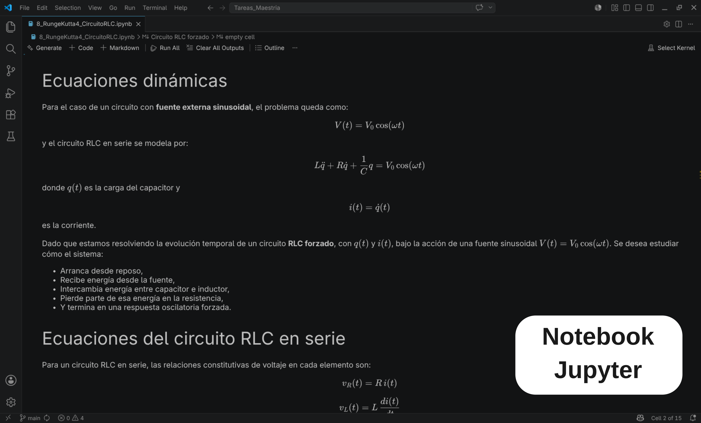
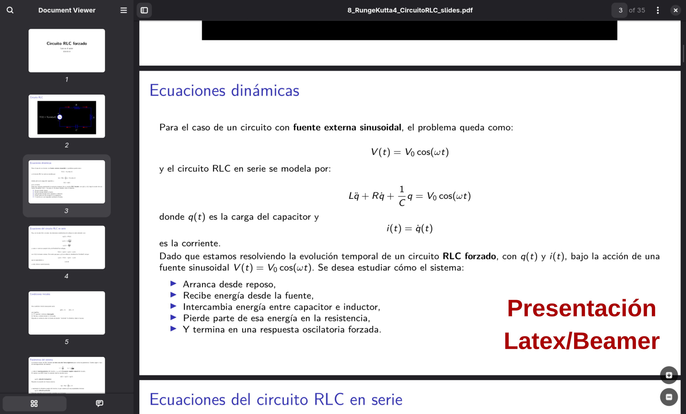

# convert_ipynb_to_beamer

Convierte un Jupyter Notebook (`.ipynb`) en una presentación PDF de Beamer.
Cada celda del notebook se convierte en una o varias diapositivas. El resultado
es una carpeta que contiene el PDF compilado, el código fuente `.tex` editable
y un directorio `assets/` con todas las figuras embebidas.

Aquí se demuestra un ejemplo de conversión:

<div style="display: flex; align-items: center; gap: 15px;">
  
  
</div>

---

## Tabla de contenidos

1. [Estructura del notebook](#1-estructura-del-notebook)
2. [Uso](#2-uso)
3. [Salida](#3-salida)
4. [Versión de Python](#4-versión-de-python)
5. [Dependencias](#5-dependencias)

---

## 1. Estructura del notebook

### 1.1 Primera celda: título y autor

La **primera celda Markdown** del notebook se usa exclusivamente como fuente de
la diapositiva de título. Nunca se renderiza como cuerpo de diapositiva. Debe
contener:

- Un único **encabezado de nivel 1** (`# …`) — se convierte en el título de la
  presentación.
- Opcionalmente, un **comentario HTML** con el nombre del autor — aparece como
  línea de autoría en la diapositiva de título.

```markdown
# Métodos Numéricos para EDOs
<!-- Luis Miguel Patiño Buendia -->
```

Si el comentario HTML está ausente, la línea de autoría usa `Luis Miguel Buendía`
como valor por defecto. Si el encabezado está ausente o la celda contiene más de
uno, el título cae en un texto genérico de respaldo.

> El comentario HTML `<!-- -->` **solo es válido en esta primera celda**. Usarlo
> en cualquier otra celda Markdown abortará la conversión con un error
> (ver [§ 1.4 Sintaxis no soportada](#14-sintaxis-no-soportada)).

---

### 1.2 Celdas Markdown: diapositivas de contenido

Cada celda Markdown posterior a la primera se convierte en **una diapositiva**
(o más, si se activa la división automática — ver
[§ 1.5](#15-división-automática-de-diapositivas)).

**Título del marco.** El primer encabezado encontrado en la celda (cualquier
nivel, de `#` a `######`) se usa como título de la diapositiva y se elimina
del cuerpo para que no aparezca dos veces. Si no hay encabezado, el título por
defecto es `Celda sin título`.

```markdown
## Método de Euler hacia adelante

La regla de actualización es:

$$
y_{n+1} = y_n + h \, f(t_n,\, y_n)
$$

Este es un método explícito de primer orden.
```

**Celdas de imagen única.** Una celda cuyo contenido completo sea una sola
referencia de imagen se convierte en una diapositiva de imagen a pantalla
completa, con el texto alternativo como título.

```markdown

```

Las rutas de imagen se resuelven de forma relativa al directorio del archivo
notebook. Si una imagen no se encuentra, se inserta un cuadro de marcador
visible en lugar de abortar la conversión.

**Sintaxis Markdown soportada:**

- Párrafos, **negrita**, *cursiva*, `código en línea`
- Bloques de código cercados (`` ``` `` o `~~~`), con o sin etiqueta de lenguaje
- Listas ordenadas y no ordenadas
- Tablas tipo pipe y tablas multilínea
- Matemáticas en línea `$…$` y en bloque `$$…$$`
- Hipervínculos `[texto](url)`
- Comandos LaTeX en bruto (se pasan directamente al compilador)

---

### 1.3 Celdas de código: diapositivas de código y resultados

Cada celda de código produce al menos una diapositiva con el código fuente
resaltado sintácticamente. Cada salida asociada a esa celda genera una
diapositiva separada de resultados. Los títulos de ambos tipos de diapositiva
son **`"Código Python"`** y **`"Resultados numéricos"`** por defecto, y pueden
cambiarse con las opciones `--code-title` y `--output-title`
(ver [§ 2 Uso](#2-uso)).

Tipos de salida soportados:

| Tipo de salida | Cómo se renderiza |
|---|---|
| `stream` (stdout / stderr) | Bloque verbatim en fuente monoespaciada |
| `display_data` / `execute_result` con `image/png` | Figura en línea |
| `display_data` / `execute_result` con `image/jpeg` | Figura en línea |
| `display_data` / `execute_result` con `text/plain` | Bloque verbatim |

> **Caracteres no ASCII en celdas de código** (letras griegas, caracteres
> acentuados, símbolos especiales) se eliminan silenciosamente durante la
> conversión a ASCII para compatibilidad con LaTeX. Se recomienda usar
> únicamente identificadores y literales de cadena ASCII en el código que
> se mostrará en las diapositivas.

---

### 1.4 Sintaxis no soportada

Las siguientes construcciones Markdown **no están soportadas** en ninguna celda
que no sea la primera. Si el validador detecta alguna de ellas, el script se
detiene de inmediato con un mensaje de error que indica el número de celda y
la línea, y el notebook **no se convierte**.

| Construcción | Ejemplo | Motivo |
|---|---|---|
| Etiquetas HTML | `<div>`, `<br/>`, `<span>` | No son válidas en LaTeX |
| Comentarios HTML | `<!-- nota -->` | No son válidos en LaTeX |
| Listas de tareas de GitHub | `- [ ] item` / `- [x] item` | Requiere `wasysym` (no cargado) |
| Texto tachado | `~~texto~~` | Requiere `ulem` (no cargado) |
| Emoji shortcodes | `:smile:` `:rocket:` | Sin equivalente en LaTeX |
| Directivas MyST / Sphinx | `:::{note}` | Pandoc no las soporta |
| Bloques de línea | `\| texto` (pipe solitaria al inicio de línea) | No válidos en LaTeX |
| Definiciones de notas al pie | `[^1]: texto` | Comportamiento poco fiable dentro de marcos Beamer |

Los emojis Unicode (😊, 🚀) escritos directamente en el código fuente de la
celda —a diferencia de los shortcodes— también son eliminados silenciosamente
por el normalizador ASCII, por lo que deben evitarse en celdas de código y
en sus salidas.

---

### 1.5 División automática de diapositivas

Las celdas demasiado largas se dividen automáticamente en lugar de generar
una diapositiva desbordada.

| Tipo de celda | Máximo de líneas por diapositiva | Máximo de caracteres por diapositiva | Estrategia de división |
|---|---|---|---|
| Markdown | 12 | 1 500 | En encabezados primero, luego en líneas en blanco entre párrafos |
| Código | 38 | 2 800 | En límites de función `def` primero, luego en líneas en blanco |

Si un solo párrafo o función supera el límite, se coloca en su propia
diapositiva independientemente.

---

### 1.6 Estructura recomendada del notebook

```
Celda 1  [Markdown]  # Título de la presentación
                     <!-- Nombre del autor -->

Celda 2  [Markdown]  ## Tema A
                     Texto introductorio, ecuaciones, listas o una imagen única.

Celda 3  [Código]    Código fuente Python.
                     ↳ salidas → se renderizan como diapositivas de resultados separadas

Celda 4  [Markdown]  ## Tema B
                     …

…
```

---

## 2. Uso

```bash
python3 convert_ipynb_to_beamer.py <notebook> [opciones]
```

### Argumento posicional

| Argumento | Descripción |
|---|---|
| `notebook` | Ruta al archivo `.ipynb` a convertir. Obligatorio. |

### Opciones

| Bandera | Valor por defecto | Descripción |
|---|---|---|
| `--out RUTA` | `<directorio_notebook>/<nombre_notebook>/` | Ruta a la carpeta de salida. Se crea si no existe. |
| `--keep-workdir` | desactivado | Conserva el directorio de trabajo temporal tras la ejecución. Útil para inspeccionar el log completo de LaTeX cuando ocurre un error de compilación. |
| `--code-title TÍTULO` | `"Código Python"` | Título que aparece en las diapositivas generadas a partir de celdas de código Python. |
| `--output-title TÍTULO` | `"Resultados numéricos"` | Título que aparece en las diapositivas generadas a partir de las salidas de ejecución de celdas de código. |
| `-h` / `--help` | — | Muestra la ayuda y termina. |

### Ejemplos

Convertir un notebook usando la ubicación de salida por defecto:

```bash
python3 convert_ipynb_to_beamer.py metodos_numericos.ipynb
# Salida: metodos_numericos/
```

Especificar una carpeta de salida personalizada:

```bash
python3 convert_ipynb_to_beamer.py metodos_numericos.ipynb --out slides/
```

Conservar el directorio de trabajo temporal para inspeccionar el log de LaTeX
tras un error:

```bash
python3 convert_ipynb_to_beamer.py metodos_numericos.ipynb --keep-workdir
```

Personalizar los títulos de las diapositivas de código y de resultados:

```bash
python3 convert_ipynb_to_beamer.py metodos_numericos.ipynb \
    --code-title "Implementación" \
    --output-title "Salida del programa"
```

### Códigos de salida

| Código | Significado |
|---|---|
| `0` | Conversión exitosa. |
| `2` | Sintaxis Markdown no soportada o error de conversión con Pandoc. El notebook no fue convertido; corrija la celda indicada y vuelva a ejecutar. |
| `3` | Error de compilación LaTeX (`latexmk` / `pdflatex`). Las últimas 30 líneas del archivo `.log` se imprimen en stderr. |

---

## 3. Salida

Si la conversión es exitosa, se crea la siguiente estructura de carpetas junto
al archivo notebook (o en `--out` si se especificó):

```
<nombre_notebook>/
├── <nombre_notebook>_slides.pdf   ← presentación compilada
├── <nombre_notebook>_slides.tex   ← código fuente LaTeX editable
└── assets/
    ├── cell3_out1.png             ← figuras de salidas de celdas de código
    ├── cell3_out2.png
    ├── comparison.png             ← figuras importadas desde celdas Markdown
    └── …
```

El archivo `.tex` referencia los assets con rutas relativas a la carpeta de
salida (`assets/nombre_archivo.png`), por lo que puede recompilarse con
`latexmk -pdf` directamente desde `<nombre_notebook>/` sin ajustar ninguna ruta.

---

## 4. Versión de Python

Requiere **Python 3.10 o superior**. El script utiliza la sintaxis de unión de
tipos `X | Y` introducida en el PEP 604 (Python 3.10). Ha sido probado y se
usa activamente con **Python 3.14**.

---

## 5. Dependencias

### 5.1 Paquetes Python: instalar con pip

| Paquete | Versión mínima | Función |
|---|---|---|
| `nbformat` | ≥ 5.0 | Lee archivos de notebook `.ipynb` |

Todas las demás importaciones (`argparse`, `re`, `shutil`, `subprocess`,
`pathlib`, etc.) forman parte de la biblioteca estándar de Python y no
requieren instalación.

Instalar dentro de un entorno virtual (recomendado):

```bash
python3 -m venv .venv
source .venv/bin/activate
pip install nbformat
```

O de forma global para el usuario:

```bash
pip install --user nbformat
```

---

### 5.2 Herramientas del sistema: instalar con DNF o APT

Estas herramientas no son paquetes Python. Deben instalarse a través del
gestor de paquetes del sistema operativo.

#### pandoc

Convierte el contenido Markdown de las celdas a LaTeX internamente.

```bash
# Fedora / RHEL
sudo dnf install pandoc

# Debian / Ubuntu
sudo apt install pandoc
```

Verificar: `pandoc --version`

#### latexmk + pdflatex

`latexmk` orquesta la construcción del PDF (invoca `pdflatex` el número
correcto de veces y resuelve las referencias cruzadas). `pdflatex` es parte
de la distribución TeX Live y se instala automáticamente como dependencia.

```bash
# Fedora / RHEL
sudo dnf install latexmk

# Debian / Ubuntu
sudo apt install latexmk
```

Verificar: `latexmk --version` y `pdflatex --version`

---

### 5.3 Paquetes LaTeX: instalar con DNF o APT

Los siguientes paquetes LaTeX están declarados en el preámbulo del documento.
Forman parte de la distribución TeX Live y se instalan a través de ella,
no mediante pip.

| Paquete(s) LaTeX | Paquete DNF | Metapaquete APT | Función |
|---|---|---|---|
| `beamer` (clase de documento) | `texlive-beamer` | `texlive-latex-extra` | Clase de presentación |
| `inputenc`, `fontenc`, `array` | *(base LaTeX — siempre presente)* | *(base LaTeX — siempre presente)* | Codificación y tipos de columna |
| `babel` + español | `texlive-babel-spanish` | `texlive-lang-spanish` | Separación silábica y tipografía en español |
| `lmodern` | `texlive-lm` | `lmodern` | Fuentes Latin Modern escalables |
| `microtype` | `texlive-microtype` | `texlive-latex-extra` | Refinamientos microtipográficos |
| `amsmath`, `amssymb` | `texlive-amsmath` | `texlive-latex-base` | Entornos matemáticos y símbolos |
| `mathtools` | `texlive-mathtools` | `texlive-latex-extra` | Extensiones de `amsmath` |
| `graphicx` | `texlive-graphics` | `texlive-latex-base` | Figuras embebidas (`\includegraphics`) |
| `xcolor` | `texlive-xcolor` | `texlive-latex-recommended` | Colores personalizados para listados de código |
| `booktabs` | `texlive-booktabs` | `texlive-latex-extra` | Líneas de tabla de calidad tipográfica |
| `ragged2e` | `texlive-ms` | `texlive-latex-extra` | `\justifying` dentro de marcos |
| `fancyvrb` | `texlive-fancyvrb` | `texlive-latex-recommended` | Entorno verbatim para salidas de celdas |
| `listings` | `texlive-listings` | `texlive-latex-extra` | Bloques de código Python con resaltado sintáctico |
| `hyperref` | `texlive-hyperref` | `texlive-latex-base` | Hipervínculos en el PDF |

#### Fedora / DNF: instalar paquetes individualmente

```bash
sudo dnf install \
    texlive-beamer \
    texlive-babel-spanish \
    texlive-lm \
    texlive-microtype \
    texlive-amsmath \
    texlive-mathtools \
    texlive-graphics \
    texlive-xcolor \
    texlive-booktabs \
    texlive-ms \
    texlive-fancyvrb \
    texlive-listings \
    texlive-hyperref
```

O instalar un esquema completo de TeX Live que incluye todos los paquetes
anteriores:

```bash
sudo dnf install texlive-scheme-medium
```

#### Debian / Ubuntu / APT

```bash
sudo apt install \
    texlive-latex-base \
    texlive-latex-recommended \
    texlive-latex-extra \
    texlive-lang-spanish \
    texlive-fonts-recommended \
    lmodern
```

O instalar la distribución completa:

```bash
sudo apt install texlive-full
```

---

### 5.4 Verificar todas las dependencias

Ejecutar esto antes del primer uso para confirmar que todas las herramientas
externas son accesibles:

```bash
python3 -c "import nbformat; print('nbformat OK:', nbformat.__version__)"
pandoc      --version | head -1
latexmk     --version | head -1
pdflatex    --version | head -1
```
